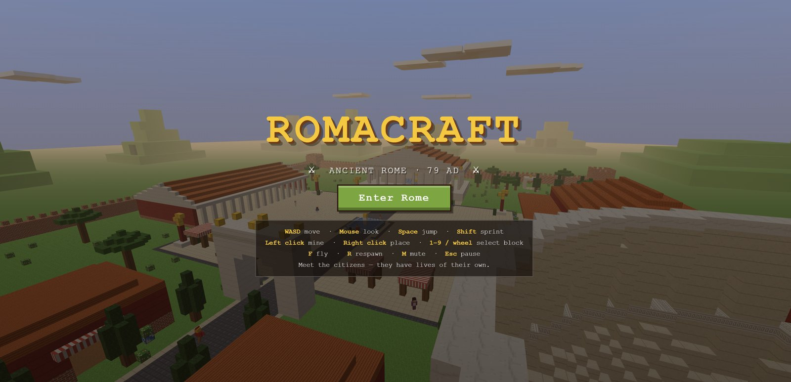

# ROMACRAFT 🏛️

A Minecraft-style voxel world set in **ancient Rome, 79 AD** — built from scratch in JavaScript and playable in the browser. Explore the forum, climb the temple steps, watch gladiators train in the Colosseum, and meet citizens who live their own lives.



## ▶️ Play

**[Play it in your browser](https://profrino.github.io/roma_craft/)** — no install needed.

Or run it locally:

```bash
python serve.py        # then open http://localhost:8744
```

Or build a single double-clickable HTML file (no server needed at all):

```bash
python build_standalone.py   # -> ROMACRAFT-standalone.html (~1.4 MB)
```

## The city

A hand-laid 168×168 voxel Rome behind defensive walls:

- **Temple of Jupiter** on a stepped podium — colonnade, marble pediments, terracotta roof, golden cult statue
- **The Colosseum** — elliptical, three stories of arched arcades, tiered seating, sand arena and four entrance tunnels
- **Forum plaza** with a mosaic fountain, gold statues on red columns, and a basalt via running gate-to-temple
- **Triumphal arch**, colonnaded **basilica**, a Pompeii-red **villa**, market stalls under striped awnings, insulae, gardens with umbrella pines — and hills on the far horizon

## Citizens with lives of their own

Fifteen NPCs with their own routines: legionaries patrol the via in formation, merchants hawk olives and figs, a priestess tends the temple, senator Marcus commutes to the basilica, the architect Vitruvius inspects his buildings, a gladiator trains in the arena, children race around the fountain, goats graze the gardens. They greet you when you come close — and stop to chat with each other.

## Controls

| Input | Action |
|---|---|
| **WASD** | Move |
| **Mouse** | Look (click the canvas to capture the pointer) |
| **Space** | Jump · double-tap to fly |
| **Shift** | Sprint (descend while flying) |
| **Left / right click** | Mine / place blocks |
| **1–9 / wheel** | Select block |
| **F** | Toggle flight |
| **R** | Respawn |
| **M** | Mute |
| **Esc** | Pause |

## Tech

Pure client-side JavaScript — no build step, no dependencies to install:

- [Three.js](https://threejs.org) (r160, vendored) for rendering
- Chunked voxel engine with face culling, DDA raycasting and swept-AABB physics
- Every texture is **procedurally painted** onto a canvas atlas at boot — zero image assets
- Procedural WebAudio sound (blocks, birds, NPC chatter)
- NPC AI: waypoint routes, wandering, auto-stepping, proximity greetings and paired conversations

## Video

[](https://www.youtube.com/watch?v=4NyETerrwfg)

▶ [Watch ROMACRAFT in action on YouTube](https://www.youtube.com/watch?v=4NyETerrwfg)

## Citation

If you use this tool in published work, please cite:

> Lovreglio, R. *ROMACRAFT*. Massey University.
> https://github.com/ProfRino/roma_craft

*Created with [Claude Code](https://claude.com/claude-code). Three.js is MIT-licensed. This is a fan-made educational project inspired by Minecraft; it is not affiliated with or endorsed by Mojang or Microsoft.*
